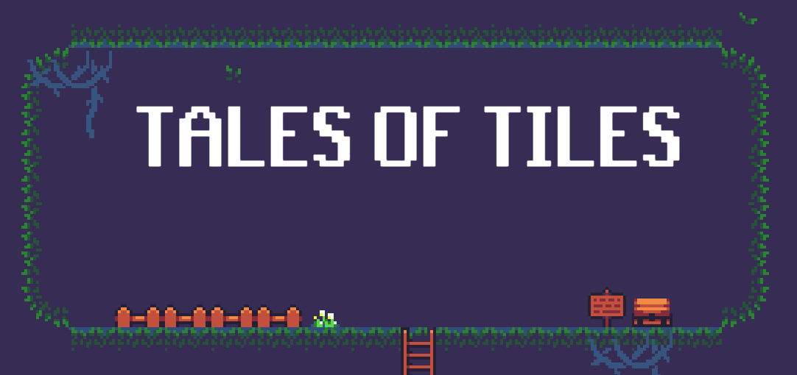

# Tales of tiles

A pixel-art 2D simple game developed in order to learn how Unity works.

All the assets, audio and music files are taken from [https://opengameart.org](https://opengameart.org).

### Trello

[Link](https://trello.com/b/q8xGP2wz/tales-of-tiles)

### Special assets

Assets in Assets\Import\KeyboardKeysAssets comes from https://universesync.itch.io/keyboard-keys-asset-pack
To see these, they require to be bought and place in the directory.
